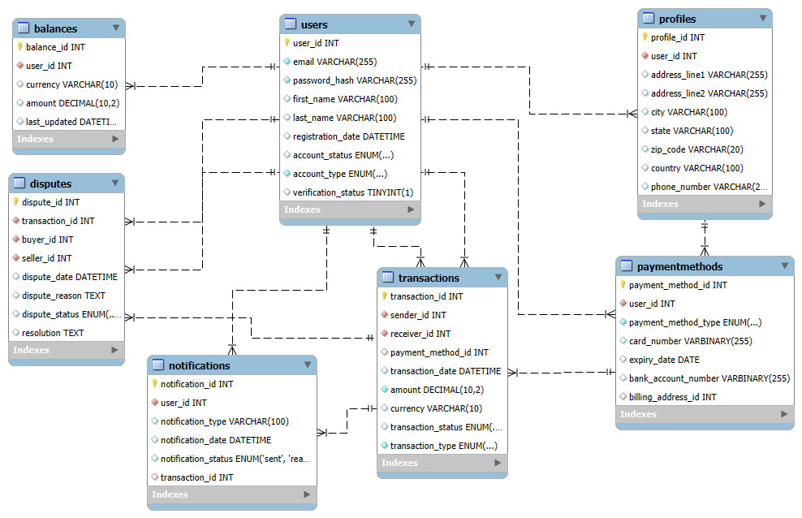

# 🧾 PayPal Product Dissection

<p align="center">
  
</p>

An in-depth breakdown of PayPal's product architecture through **SQL schema design** and a **comprehensive ER model**. This project simulates the **core components of PayPal’s payment system**, covering users, transactions, disputes, balances, and more — crafted to reflect real-world data flow and entity relationships.

---

## 📌 Project Overview

This project explores the inner workings of PayPal by:

- 📐 Designing a robust and scalable **SQL schema** based on real-world financial flows.  
- 🔗 Modeling 7+ **interconnected entities** including Users, Profiles, Payment Methods, Transactions, Disputes, and Balances.  
- 🧩 Simulating relationships between **customers, merchants, payments, and disputes**.  
- 🔍 Offering insights into how PayPal manages user authentication, payment verification, issue resolution, and transaction tracking.

---

## 🧱 ER Diagram

> 📷 *Below is the ER diagram visualizing the database structure and entity relationships.*

<p align="center">
  
</p>

---

## 🧑‍💻 Core Entities & Relationships

| Entity             | Description                                   |
|--------------------|-----------------------------------------------|
| **Users**          | Stores both customer & merchant data          |
| **Profiles**       | Contains extended user details                |
| **PaymentMethods** | Cards, banks, wallets linked to a user        |
| **Transactions**   | Records of all payments made                  |
| **Disputes**       | Customer-raised complaints or claims          |
| **Balances**       | Maintains account funds                       |
| **Notifications**  | Logs system alerts/messages                   |
| **DisputeReplies** | Tracks communication in a dispute             |

### 🔄 Relationships & Cardinality (Simplified)

| Relationship                     | Cardinality               |
|----------------------------------|---------------------------|
| Users ↔ Profiles                 | 1:1                       |
| Users ↔ PaymentMethods           | 1:N                       |
| Users ↔ Transactions             | 1:N (as sender/receiver)  |
| Transactions ↔ Disputes          | 1:1 or 1:0                |
| Disputes ↔ DisputeReplies        | 1:N                       |
| Users ↔ Balances                 | 1:1                       |
| Users ↔ Notifications            | 1:N                       |

---

## 🛠️ Tech Stack

| Tool              | Purpose                            |
|-------------------|------------------------------------|
| `SQL`             | Schema & relationship design       |
| `MySQL Workbench` | ER diagram creation                |
| `Python (docx)`   | Optional PDF/Docx reporting        |

---

## 📁 Folder Structure

📦paypal-product-dissection
 ┣ 📂images
 ┃ ┣ 📄paypal_logo.png
 ┃ ┗ 📄paypal_er_diagram.png
 ┣ 📄README.md
 ┣ 📄schema.sql
 ┗ 📄paypal_case_study.pdf
```

---

## 🌐 License

This project is licensed under the **MIT License** © 2025 [Suman Sadhukhan](#).  
You’re free to use, modify, and share it with proper attribution.

---


